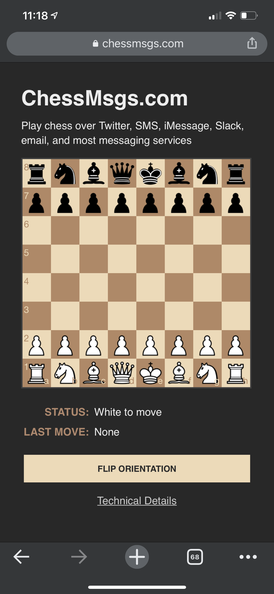

# chessmsgs.com - Play Chess over social/messaging

Created because I wanted to play chess with others without having to install software, create accounts, etc.. Game play is simple -- make your move, copy and paste the URL to your opponent, etc.



## Technical details:

**Web browser-side** - all chess logic is run in the browser

* [chessboard.js](https://github.com/oakmac/chessboardjs/) - JavaScript chessboard component - by [Chris Oakman](https://twitter.com/oakmac1)
* [chess.js](https://github.com/jhlywa/chess.js) - JavaScript chess library that is used for chess move generation/validation, piece placement/movement, and check/checkmate/stalemate detection - by [Jeff Hlywa](https://twitter.com/jhlywa)
* [body-scroll-lock](https://github.com/willmcpo/body-scroll-lock) - JavaScript library that makes it easy to manage scrolling on mobile (I needed to freeze scrolling during moves and this library works across almost all browsers) - by [Will Po](https://github.com/willmcpo)
* [JQuery](https://jquery.com/) - the above two chess libraries required it, so I used it too.

**Web Server**  - simple Node/Express server with some super simple templating to create the Open Graph and Twitter Card image URLs, links, etc.  This could have easily been a static website other than this requirement.

* [request-ip](https://www.npmjs.com/package/request-ip) - Used for logging IP address of each move to use for future scaling (create additional copies in regions, etc.)
* [nanoid](https://www.npmjs.com/package/nanoid) - Used to generate unique Game IDs
* No database/data store -- all game state info is passed back and forth between players in URL
* Deployed on [Google Cloud Run](https://cloud.google.com/run?utm_campaign=CDR_grw_series_chessapp_release_120320&utm_source=external&utm_medium=web)

**Image Server** - used to generate the image used for Open Graph and Twitter cards so that when a user posts a game link to most platforms, the platform will show the image with the current board position. I created an endpoint that looks like any other png file url ([example](https://chessmsgs.com/fenimg/rn1qkbnr/ppp1pppp/8/3p4/3P2b1/2N5/PPP1PPPP/R1BQKBNR%20w%20KQkq%20-%202%203.png)).

* [chess-image-generator](https://github.com/andyruwruw/chess-image-generator) - JavaScript library that creates a png from a [FEN](https://en.wikipedia.org/wiki/Forsyth%E2%80%93Edwards_Notation) (standard chess board notation) - by [Andrew Young](https://andyruwruw.com/)
* I made a copy of generateBuffer() as generateCustomBuffer() and customized it to do padding to match Open Graph requirements
* Deployed as a route in the web server Node express app

## Testing and deploying

#### The parts
* Main web server is in project root -- server.js
* Web content is in ./public

#### Local testing of serve - run from project root.
```
# Install all dependencies
npm install

# Run server
node server
```

Access http://localhost:8080 to test. If you are running this on your own server, you'll need to change the URL hard-coding in server.js (replace "chessmsgs.com")

#### Deploying to [Google Cloud Run](https://cloud.google.com/run?utm_campaign=CDR_grw_series_chessapp_release_120320&utm_source=external&utm_medium=web)
You can also setup continuious deployment to auto-deploy when you push to a branch or tag using [Cloud Build](https://cloud.google.com/cloud-build?utm_campaign=CDR_grw_series_chessapp_release_120320&utm_source=external&utm_medium=web))
```
npm run build
npm run deploy
```

## Why Google Cloud Run?
The hosting requirements are simple. I needed support for Node.js/Express, domain mapping, and SSL. There are several options on Google Cloud including [Compute Engine](https://cloud.google.com/compute?utm_campaign=CDR_grw_series_chessapp_release_120320&utm_source=external&utm_medium=web) (VMs), [App Engine](https://cloud.google.com/appengine?utm_campaign=CDR_grw_series_chessapp_release_120320&utm_source=external&utm_medium=web), and [Kubernetes Engine](https://cloud.google.com/kubernetes-engine?utm_campaign=CDR_grw_series_chessapp_release_120320&utm_source=external&utm_medium=web). For this app, however, I wanted to go completely serverless, which quickly led me to Cloud Run. Cloud Run is a managed platform that enables you to run stateless containers that are invocable via web requests or Pub/Sub events. 

Cloud Run is also basically free for this type of project because the always-free-tier includes 180,000 vCPU-seconds, 360,000 GiB-seconds, and 2 million requests per month (as of this writing – see the [Cloud Run pricing page](https://cloud.google.com/run/pricing?utm_campaign=CDR_grw_series_chessapp_release_120320&utm_source=external&utm_medium=web) for the latest details). Even beyond the free tier, it’s very inexpensive for this type of app because you only pay while a request is being handled on your container instance, and my code is simple and fast.
